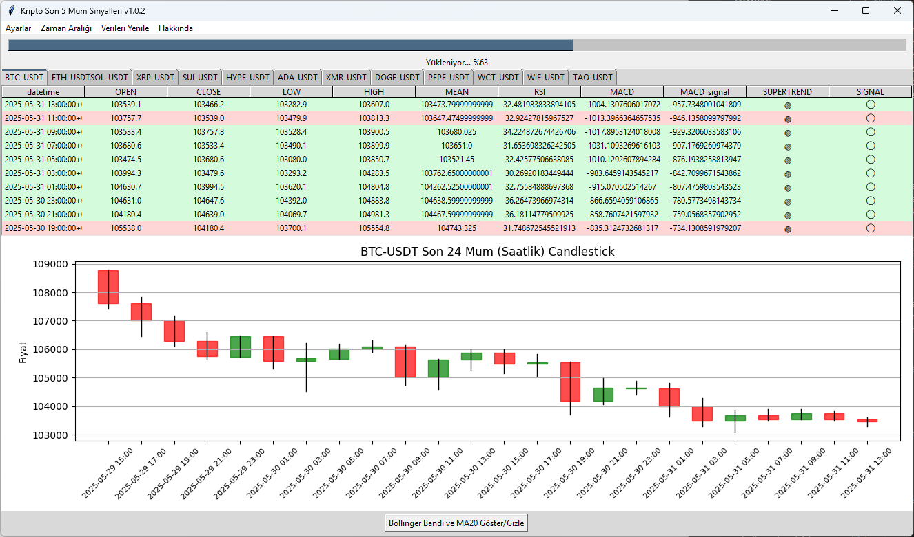

# kriptoAlSatSinyal

## Overview
This project generates trading signals for multiple cryptocurrencies using technical indicators such as RSI, MACD, and SuperTrend. It supports both command-line and graphical (tabbed) viewing of recent signals and candlestick data. You can also manage the list of coin pairs from within the graphical application.

## Files
- **sinyalUretici.py**: Main logic for fetching market data, calculating indicators, and generating trading signals for multiple coins.
- **yakinda_al_sinyali.py**: Shows the last 24 candles' indicator values and signals for all coins in a tabbed GUI, with candlestick charts and a coin pair management screen.
- **requirements.txt**: Lists the necessary Python libraries for the project.
- **install.sh**: Shell script to automate installation on Linux/macOS.
- **install.bat**: Batch script to automate installation on Windows.
- **run.sh**: Shell script to run the main signal generator.
- **run.bat**: Batch script to run the main signal generator on Windows.
- **coinler.txt**: List of coin pairs to monitor (one per line).

## Installation Instructions

### 1. Clone the repository:
```sh
git clone <repository-url>
cd kriptoAlSatSinyal
```

### 2. Install dependencies

#### Linux/macOS:
```sh
bash install.sh
```

#### Windows:
```bat
install.bat
```

## Usage

### Terminal Sinyal Üretici (Tüm coinler için):
```sh
python sinyalUretici.py
```

### Grafiksel Tablo ve Mum Grafiği (Tüm coinler için):
```sh
python yakinda_al_sinyali.py
```
- Her coin için son 24 saatlik mum, teknik göstergeler ve sinyal tablosu sekmelerde gösterilir.
- Her sekmede ayrıca son 24 mum için candlestick grafik yer alır.
- Yükleme sırasında ilerleme çubuğu gösterilir.
- Menüden "Ayarlar > Coin Çiftlerini Yönet" ile coinler.txt dosyasını uygulama içinden düzenleyebilirsiniz.

## Ekran Görüntüsü

Aşağıda uygulamanın örnek bir ekran görüntüsü yer almaktadır:



## coinler.txt Örneği
```
BTC-USDT
ETH-USDT
SOL-USDT
```

## Notlar
- Tüm coin çiftleri KuCoin borsasında desteklenmelidir.
- `requirements.txt` dosyasındaki tüm paketler kurulmalıdır.
- Grafiksel arayüz için `tkinter` ve `matplotlib` gereklidir.